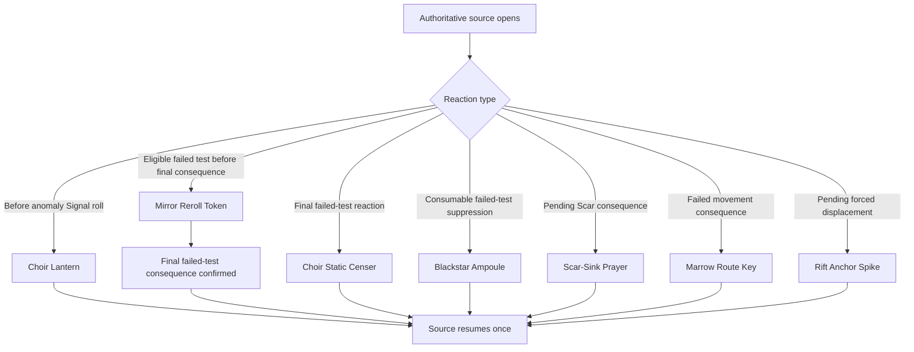

# Item Effect System Final Audit

Date: 2026-07-13

Audited revision: `462328d feat: implement rift anchor spike charges`

Scope: the 60 canonical items only (30 normal Equipment and 30 Artifacts). This is a report-only release-candidate audit; no content, runtime, schema, UI, test, validation, or asset change is part of it.

## Executive verdict

The canonical inventory reconciles exactly to 60 unique IDs: 30 normal Equipment and 30 Artifacts. Tier separation, Artifact reward routing, exact-instance charged state, authoritative reactions, persistence, and private/public projection boundaries are well protected. All ten charged Artifacts have distinct, server-authoritative identities and no automatic recharge.

The system is ready for broad playtesting, but it is not yet a clean release candidate. Sixteen normal Equipment remain deliberately deferred from typed passive validation and therefore lack a fully authoritative predicate. Ashen Route Compass also retains one inaccurate acquisition note that says it can soften anomaly failures. Eight older passive/immediate Artifacts rely on family-level coverage without a direct card-to-owned-effect regression test.

RC verdict totals (one primary verdict per item):

| Verdict | Count |
| --- | ---: |
| RC-ready | 35 |
| Wording polish only | 1 |
| Light mechanical tuning | 0 |
| Missing direct test | 8 |
| Blocked/redesign required | 16 |
| **Total** | **60** |

There is no live blocker in the charged Artifact, reaction, persistence, tier-separation, or asset pipelines. The live RC blockers are the 16 deferred passive Equipment definitions.

## Canonical inventory and effect-model reconciliation

The inventory is sourced from the canonical tier-separation test and the 30 files in `content/cards/artifacts`. No duplicate or missing IDs were found. Normal Equipment uses normal gear art and starting/common-shop eligibility; Artifact cards and their owned gear/follower implementations remain in rare Artifact paths. No Artifact is eligible as starting or common-shop Equipment.

| Effect model | Equipment | Artifacts | Total |
| --- | ---: | ---: | ---: |
| Permanent passive | 8 | 2 | 10 |
| Conditional passive | 21 | 6 | 27 |
| Consumable | 1 | 6 | 7 |
| Exhaust | 0 | 6 | 6 |
| Charged | 0 | 10 | 10 |
| **Total** | **30** | **30** | **60** |

“Conditional passive” includes the 16 deliberately deferred Equipment definitions and the immediate/conditional Artifact acquisition models. It describes intended catalog identity, not an assertion that every deferred predicate is already enforceable.

## Item-by-item audit

Legend: `Eq` means the effect requires equipped state; `Owned` means exact owned-instance state; `C` means carried consumable; `—` means no per-use state. Phone presentation is the shared inventory card unless a reaction/action prompt is named. Reconnect status refers to authoritative session serialization, not client-local reconstruction.

### Normal Equipment (30)

| ID | Name | Model / timing | Equip and state | Authoritative path and phone behavior | Persistence | Risk | RC verdict |
| --- | --- | --- | --- | --- | --- | --- | --- |
| `rustknife-carbine` | Rustknife Carbine | Conditional passive; battle roll | Eq / — | Typed battle predicate; effective Guile source shown | Equipped slot | Low | RC-ready |
| `nailspike-maul` | Nailspike Maul | Conditional passive; battle roll | Eq / — | Typed battle predicate; effective Grit source shown | Equipped slot | Low | RC-ready |
| `emberlock-pistol` | Emberlock Pistol | Conditional passive; battle roll | Eq / — | Typed battle predicate; effective Command source shown | Equipped slot | Low | RC-ready |
| `chainhook-blade` | Chainhook Blade | Conditional passive; “fighting for position” | Eq / — | Generic carried/equipped catalog path; predicate is not typed | Equipped slot | High | Blocked/redesign required |
| `ashen-bayonet` | Ashen Bayonet | Conditional passive; battle roll | Eq / — | Typed battle predicate; effective Grit source shown | Equipped slot | Low | RC-ready |
| `stormcut-axe` | Stormcut Axe | Conditional passive; battle roll | Eq / — | Typed battle predicate; effective Forge source shown | Equipped slot | Low | RC-ready |
| `rivetplate-vest` | Rivetplate Vest | Permanent passive | Eq / — | Typed permanent modifier; source shown | Equipped slot | Low | RC-ready |
| `sootmantle-cloak` | Sootmantle Cloak | Permanent passive | Eq / — | Typed permanent modifier; source shown | Equipped slot | Low | RC-ready |
| `ironhide-bracers` | Ironhide Bracers | Permanent passive | Eq / — | Typed permanent modifier; source shown | Equipped slot | Low | RC-ready |
| `salvage-guard-mask` | Salvage Guard Mask | Permanent passive | Eq / — | Typed permanent modifier; source shown | Equipped slot | Low | RC-ready |
| `chapel-guard-harness` | Chapel Guard Harness | Permanent passive | Eq / — | Typed permanent modifier; source shown | Equipped slot | Low | RC-ready |
| `wardens-kneeplate` | Warden's Kneeplate | Permanent passive | Eq / — | Typed permanent modifier; source shown | Equipped slot | Low | RC-ready |
| `route-compass` | Route Compass | Conditional passive; movement tests | Eq / — | Predicate is deferred; not the charged Ashen Route Compass | Equipped slot | High | Blocked/redesign required |
| `field-lens` | Field Lens | Conditional passive; hazard inspection | Eq / — | Predicate is deferred | Equipped slot | High | Blocked/redesign required |
| `lockjaw-kit` | Lockjaw Kit | Conditional passive; locks/bargains | Eq / — | Predicate is deferred | Equipped slot | High | Blocked/redesign required |
| `bridge-spike` | Bridge Spike | Conditional passive; route work | Eq / — | Predicate is deferred | Equipped slot | High | Blocked/redesign required |
| `static-probe` | Static Probe | Conditional passive; anomalies | Eq / — | Predicate is deferred | Equipped slot | High | Blocked/redesign required |
| `surveyor-chalk` | Surveyor Chalk | Conditional passive; coordinated movement | Eq / — | Predicate is deferred | Equipped slot | High | Blocked/redesign required |
| `cinder-suture-kit` | Cinder Suture Kit | Conditional passive; recovery | Eq / — | Predicate is deferred | Equipped slot | High | Blocked/redesign required |
| `saintwire-splint` | Saintwire Splint | Conditional passive; “holding together” | Eq / — | Predicate/model boundary is deferred | Equipped slot | High | Blocked/redesign required |
| `salt-gauze-wrap` | Salt Gauze Wrap | Conditional passive; recovery | Eq / — | Predicate is deferred | Equipped slot | High | Blocked/redesign required |
| `last-breath-rivet` | Last-Breath Rivet | Permanent passive | Eq / — | Typed permanent modifier; source shown | Equipped slot | Low | RC-ready |
| `ember-poultice` | Ember Poultice | Conditional passive; recovery | Eq / — | Predicate is deferred | Equipped slot | High | Blocked/redesign required |
| `wound-clamp` | Wound Clamp | Permanent passive | Eq / — | Typed permanent modifier; source shown | Equipped slot | Low | RC-ready |
| `black-route-fuse` | Black Route Fuse | Consumable; matching battle roll | C / consumed | Server accepts use, discards once, grants +3 Grit, advances escalation +1; no Heat cost | Pending bonus and removal persist | Medium | RC-ready |
| `salvage-ledger` | Salvage Ledger | Conditional passive; shop dealings | Eq / — | Predicate is deferred | Equipped slot | High | Blocked/redesign required |
| `mirror-token` | Mirror Token | Conditional passive; contested tests | Eq / — | Predicate is deferred; distinct from Mirror Reroll Token | Equipped slot | High | Blocked/redesign required |
| `oath-chain` | Oath Chain | Conditional passive; holding a vow | Eq / — | Predicate is deferred | Equipped slot | High | Blocked/redesign required |
| `red-march-bell` | Red March Bell | Conditional passive; danger closes | Eq / — | Predicate is deferred; distinct from Red March Warbell | Equipped slot | High | Blocked/redesign required |
| `signal-lantern` | Signal Lantern | Conditional passive; unstable sectors | Eq / — | Predicate is deferred | Equipped slot | High | Blocked/redesign required |

### Artifacts (30)

| ID | Name | Model / timing | Equip and state | Authoritative path and phone behavior | Persistence | Risk | RC verdict |
| --- | --- | --- | --- | --- | --- | --- | --- |
| `artifact-ashen-route-compass` | Ashen Route Compass | Charged; after movement roll | Eq / Owned 2 charges | Exact-instance ±1 movement adjustment; Charges X/2 and authoritative prompt | Charges/revision persist | Medium | Wording polish only |
| `artifact-bell-votive` | Bell Votive Casket | Consumable; owned use | C / consumed | Exact owned consumable grants Veil Hook once | Removal persists | Medium | RC-ready |
| `artifact-black-route-fuse` | Black Route Fuse | Consumable acquisition | C / consumed gear | Grants canonical Fuse, whose battle use is authoritative | Gear/removal persist | Medium | RC-ready |
| `artifact-blackstar-ampoule` | Blackstar Ampoule | Consumable reaction; failed test | C / consumed | Typed failure reaction suppresses its approved consequence once | Reaction/removal persist | High | RC-ready |
| `artifact-choir-lantern` | Choir Lantern | Charged; before anomaly Signal test | Eq / Owned 2 charges | Exact-instance pre-roll Signal support; private prompt | Charges/reaction persist | Medium | RC-ready |
| `artifact-choir-static-censer` | Choir Static Censer | Charged; after failed test | Eq / Owned 2 charges | Exact-instance failure reaction; private prompt | Charges/reaction persist | High | RC-ready |
| `artifact-cinder-suture-kit` | Cinder Suture Kit | Conditional passive acquisition | Eq / — | Grants normal Cinder Suture Kit | Gear persists | Medium | Missing direct test |
| `artifact-ember-burden-idol` | Ember Burden Idol | Immediate typed acquisition | — / — | Grants 1 trophy and note authoritatively | Result persists | Medium | Missing direct test |
| `artifact-fandiablos` | Fandiablos | Exhaust follower; owner-turn refresh | Owned / exhausted | Typed follower action and Ready/Exhausted presentation | Exhaust persists | High | RC-ready |
| `artifact-gate-saint-key` | Gate-Saint Key | Charged; final-gate confirmation | Eq / Owned 1 charge | Party safe-conduct effect, server revalidates gate/routes | Charge/effect persist | High | RC-ready |
| `artifact-heat-sink-prayer` | Scar-Sink Prayer | Charged; pending Scar consequence | Eq / Owned 2 charges | Suppresses one typed pending Scar consequence; visible name normalized | Charges/reaction persist | High | RC-ready |
| `artifact-last-breath-rivet` | Last-Breath Rivet | Permanent passive acquisition | Eq / — | Grants normal permanent Rivet gear | Gear persists | Medium | Missing direct test |
| `artifact-lucy-hell-puppy` | Lucy, Hell Puppy | Exhaust follower; round boundary | Owned / exhausted | Typed follower action and Ready/Exhausted presentation | Exhaust persists | High | RC-ready |
| `artifact-marrow-route-key` | Marrow Route Key | Charged reaction; failed movement test | Eq / Owned 2 charges | Adjacent legal detour plus approved Wound cost; server-issued targets | Charges/reaction persist | High | RC-ready |
| `artifact-mira-rift-twin` | Mira, Rift-Twin | Conditional follower passive | Owned / — | Rumi/Mira team predicate through follower bonuses | Follower persists | Medium | Missing direct test |
| `artifact-mirror-reroll-token` | Mirror Reroll Token | Exhaust reaction; eligible failed test | Eq / exhausted | Typed reroll reaction; Ready/Exhausted prompt | Exhaust/reaction persist | High | RC-ready |
| `artifact-murkclaw-gravecrow` | Murkclaw & Gravecrow | Exhaust follower; round boundary | Owned / exhausted | Typed follower action and Ready/Exhausted presentation | Exhaust persists | High | RC-ready |
| `artifact-oath-chain-ledger` | Oath-Chain Ledger | Conditional contract object | Eq / — | Grants typed ledger gear; contract interaction remains bounded | Gear persists | Medium | Missing direct test |
| `artifact-oathchain-lens` | Oathchain Lens | Charged; owner action with active Contract | Eq / Owned 2 charges | Private server-derived current target reading; TV gets generic status | Charges/private reveal persist | High | RC-ready |
| `artifact-pale-ledger-token` | Pale Ledger Token | Consumable; owned use | C / consumed | Exact owned consumable grants approved Fixer result once | Removal persists | Medium | RC-ready |
| `artifact-red-march-warbell` | Red March Warbell | Exhaust; approved battle window | Eq / exhausted | Typed battle support and Ready/Exhausted presentation | Exhaust persists | High | RC-ready |
| `artifact-rift-anchor-spike` | Rift Anchor Spike | Charged reaction; pending forced displacement | Eq / Owned 2 charges | Suppresses only displacement; other source consequences continue | Charges/reaction persist | High | RC-ready |
| `artifact-route-star` | Route Star | Charged; after multi-route destination selection | Eq / Owned 2 charges | Selects non-default server-issued route only; preview is free | Charges/route selection persist | High | RC-ready |
| `artifact-rune-eye-raven` | The Rune-Eye Raven | Exhaust follower; round boundary | Owned / exhausted | Typed follower action and Ready/Exhausted presentation | Exhaust persists | High | RC-ready |
| `artifact-saintwire-splint` | Saintwire Splint | Permanent/conditional gear acquisition | Eq / — | Grants normal Splint gear | Gear persists | Medium | Missing direct test |
| `artifact-throne-crown-fragment` | Throne-Crown Fragment | Immediate typed acquisition | — / — | Advances `sealRestorationMarks` by 1 and grants note | Scenario state persists | High | Missing direct test |
| `artifact-void-key` | Void Key | Charged; route confirmation | Eq / Owned 2 charges | Typed gate restriction override only; all other route rules revalidated | Charges/route state persist | High | RC-ready |
| `artifact-void-salt-poultice` | Void-Salt Poultice | Consumable; owned use | C / consumed | Exact owned consumable heals its approved Wound once | Removal/result persist | Medium | RC-ready |
| `artifact-yard` | Yard Bellframe Core | Consumable; owned use | C / consumed | Exact owned consumable grants Marshal Seal once | Removal/result persist | Medium | RC-ready |
| `artifact-zoey-thorn-violet` | Zoey, Thorn-Violet | Conditional follower passive | Owned / — | Rumi/Mira/Zoey triad predicate through follower bonuses | Follower persists | Medium | Missing direct test |

## Equipment findings

The 14 normalized normal Equipment items obey their declared models: eight permanent passives, five battle-only conditional passives, and Black Route Fuse. Equipped checks are authoritative; removing, selling, or unequipping an item removes its modifier immediately because the stat calculation reads the current equipped slots rather than cached client totals.

All 16 historical passive deferrals remain genuinely deferred. The validator deliberately fails if any of these IDs gains `effectModel` while still listed, and the current catalog confirms none has been normalized. No deferral is obsolete:

`chainhook-blade`, `route-compass`, `field-lens`, `lockjaw-kit`, `bridge-spike`, `static-probe`, `surveyor-chalk`, `cinder-suture-kit`, `saintwire-splint`, `salt-gauze-wrap`, `ember-poultice`, `salvage-ledger`, `mirror-token`, `oath-chain`, `red-march-bell`, `signal-lantern`.

Their prose predicates are not equivalent to the supported `battle` condition and should not be normalized by broadening that predicate. Each requires an explicit design decision and direct test. Until then, the validator deferral is truthful technical debt, not an obsolete exception.

## Artifact and charged-model findings

All Artifacts remain rare reward/relic-dealer content. The Relic Dealer spends three stored `completedContracts` IDs for one Artifact; normal Equipment cannot enter that selection. Artifact cards do not appear in ordinary starting/common-shop pools.

The ten charged Artifacts are mechanically distinct:

| Artifact | Exclusive identity | Does not replace |
| --- | --- | --- |
| Void Key | One typed gate restriction override | Route selection, distance, party safe conduct |
| Ashen Route Compass | Adjust the rolled movement total by exactly ±1 | Gate bypass or route selection |
| Gate-Saint Key | One-round allied final-gate safe conduct | General gate bypass or distance |
| Marrow Route Key | Failed-movement adjacent detour with Wound cost | Normal movement or forced-displacement defense |
| Choir Lantern | Pre-roll anomaly Signal support | Post-failure suppression or reroll |
| Choir Static Censer | Post-failure typed reaction | Pre-roll support or Scar suppression |
| Scar-Sink Prayer | Suppress a pending Scar consequence | Healing, Wound prevention, or generic failure prevention |
| Oathchain Lens | Private active-Contract target information | Progress, reward, legality, or movement help |
| Route Star | Select a non-default authoritative route variant | Distance or destination legality |
| Rift Anchor Spike | Suppress one pending forced displacement | Rollback, movement immunity, or other consequences |

Exact owned-instance state, charge spending, stale/wrong-seat rejection, duplicate-copy independence, and reconnect preservation are direct regression targets across these vertical slices. All declare `rechargeRule: none`; no round, shop, mission, or reconnect path refills them.

One wording defect remains: `artifact-ashen-route-compass` grants the note “Compass charge: spend to soften movement or anomaly failures.” The implemented effect only adjusts the movement total after a movement roll. This is inaccurate player-facing guidance and should be removed or replaced with the approved ±1 movement rule in a report-approved wording-only follow-up.

## Reaction priority and isolation

The reaction systems are source-owned typed windows, not a shared interchangeable queue. A reaction ID is validated together with seat, source event, phase/context, eligible item instance, and unresolved state. Cross-system or stale IDs reject, and accepted resolution closes or advances the source exactly once.

The intended ordering is: pre-roll reactions; roll; eligible reroll; finalized failure; exactly the typed consequence/reaction window owned by that system; remaining consequences; close. Choir Static Censer and Blackstar Ampoule may both concern failure, but their typed eligibility and owned action paths prevent an item from consuming another system's reaction ID. Scar, failed-movement, and forced-displacement reactions are downstream typed lifecycles and cannot be substituted for one another. No current rule authorizes stacking two suppressions on the same reaction.

## Ownership, persistence, and duplicate protection

- Charged and exhaust items use exact owned-instance identifiers. Duplicate copies maintain independent state.
- Consumables are removed only on accepted authoritative use; stale, invalid, or wrong-seat requests consume nothing.
- Exhausted items refresh only at their declared owner-turn/round boundary. Reconnect does not refresh them.
- Charged items never recharge automatically. Reconnect, round transition, shop entry, and mission completion preserve current charges.
- Temporary route, Contract-reveal, Scar, and displacement state has a typed lifecycle and expires or closes at its approved boundary.
- Legacy instances missing state initialize once through the compatibility path; reconnect serializes the initialized state rather than deriving it again.
- Removing or losing an exact instance removes its associated state. Completed actions are protected from replay.

## Phone and TV presentation

The phone distinguishes Equipped from Carried and renders model state as Charges X/Y, Ready/Exhausted, One Use, or passive text. Actions and disabled reasons are projected from authoritative eligibility. Artwork/lore inspection remains separate from activation. Owner-only prompts and private Contract/reaction details are absent from other seats.

The TV receives concise public-safe state and outcomes, not actionable controls, private inventories, or remaining charge counts. Existing movement preview/journey, encounter, battle, and reaction surfaces are reused; charged implementations did not add competing focus modes. Modifier source labels are item-specific and stable.

The Ashen Route Compass acquisition note is the sole confirmed contradictory item-facing rule. Lowercase thematic uses such as “heat-clean needles” are flavor, not a Heat resource rule. Scar-Sink Prayer is the visible name; `artifact-heat-sink-prayer` and `heat-sink-prayer` remain compatibility IDs only.

## Tier and reward integration

- Normal missions primarily award Salvage, Equipment, or completed Contract cards through their approved paths.
- Artifact rewards remain rare, and Relic Dealer exchange consumes three authoritative `completedContracts` entries for one Artifact.
- Artifact selection cannot return normal Equipment; normal shops and starting pools cannot return Artifact-tier items.
- Rift Anchor Spike now grants its own exact owned instance. It no longer converts into Veil Hook.
- Existing Veil Hook acquisition and ownership remain separate and non-destructively preserved.

## Validation and test coverage

Current validation covers duplicate/missing canonical IDs, tier separation, passive-model metadata, consumable/exhaust/charged metadata, positive charge costs, no-recharge declarations, typed activation timing, unsupported activation costs, item art mapping, and player-facing legacy Heat/Risk guardrails. The engine/client suites cover authoritative charge/exhaust/consumption, stale and wrong-seat rejection, projection privacy, reconnect, and the specialized route, Scar, Contract, and displacement lifecycles.

Items lacking a direct, item-specific behavioral regression test are conservatively counted as 24:

- The 16 deferred passive Equipment above. Tier/catalog tests mention them, but no approved predicate exists to test.
- Eight passive/immediate Artifacts whose behavior is primarily protected by generic acquisition or follower/model tests rather than a direct card-to-result regression: `artifact-cinder-suture-kit`, `artifact-ember-burden-idol`, `artifact-last-breath-rivet`, `artifact-mira-rift-twin`, `artifact-oath-chain-ledger`, `artifact-saintwire-splint`, `artifact-throne-crown-fragment`, and `artifact-zoey-thorn-violet`.

The latter eight are classified “missing direct test,” not mechanically broken. Add narrow acquisition/result/reconnect tests before calling them individually RC-certified. The 16 deferred Equipment first require approved predicates; tests must not freeze the current ambiguity.

## Heat and legacy cleanup

No canonical player-facing item rule uses Heat as a cost, resource, meter, or active consequence. No `heatCost` affects item eligibility. Scar-Sink Prayer is player-visible under its approved name. The serialized IDs `artifact-heat-sink-prayer` and `heat-sink-prayer`, character Heat storage, and generic legacy effect keys remain compatibility boundaries only. No hidden Heat payment was found in the charged, consumable, exhaust, or reaction paths.

## Highest-risk items and playtest watchlist

Highest implementation risk remains concentrated in the specialized authoritative lifecycles, despite their green regression coverage:

1. Rift Anchor Spike — source continuation and no-arrival behavior after displacement suppression.
2. Route Star — explicit route persistence after revision changes and destination changes.
3. Marrow Route Key — Wound payment, legal detour selection, and failed-test continuation.
4. Gate-Saint Key — party scope without bypassing unrelated gate/route restrictions.
5. Oathchain Lens — owner-only target descriptors and Contract revision invalidation.
6. Scar-Sink Prayer — suppressing only the pending Scar consequence.
7. Blackstar Ampoule — one-use failure suppression and duplicate protection.
8. Choir Static Censer — post-failure timing versus reroll timing.
9. Choir Lantern — pre-roll eligibility and no post-roll use.
10. Ashen Route Compass — revision invalidation and the inaccurate acquisition note.

Broad playtests should also watch whether the 16 deferred Equipment are perceived as always-on bonuses, whether carried/equipped wording matches player expectations, and whether any vague predicate becomes a dominant interpretation.

## Four-seat release critique

**New Player.** Charged, exhausted, and consumable states are now understandable and visible, and reaction prompts explain the current authority window. The Compass note is actively misleading and should be corrected. The 16 deferred predicates require clearer rules before release.

**Optimizer.** Exact instances, versioned source state, and authoritative eligibility close the major duplication, reconnect, and wrong-seat exploits. The main optimization ambiguity is the deferred Equipment wording: without typed predicates, players cannot reliably know when a bonus should count.

**Family Player.** The shared inventory vocabulary reduces bookkeeping, and the TV does not expose private controls. Specialized reactions remain short and resume their source automatically. Deferred conditional prose is the main table-discussion burden.

**Rules Lawyer.** Typed reaction IDs, source-event checks, exact-instance state, and authored timing provide deterministic precedence. The remaining failures are documentary/model alignment rather than cross-system state corruption: 16 undefined predicates and one stale Compass note.

## Recommended release sequence

1. Correct the Ashen Route Compass acquisition note in a wording-only commit with a focused presentation assertion.
2. Approve and normalize the 16 deferred Equipment in small predicate families; remove each validator deferral only with direct engine and presentation tests.
3. Add direct acquisition/result/reconnect tests for the eight older passive/immediate Artifacts.
4. Run focused four-seat playtests of reaction timing and the ten-item high-risk watchlist.

After steps 1–3, and assuming the full suite remains green, the item-effect system can be promoted from broad-playtest ready to release-candidate ready.

## Verification record

The requested commands were run after this report was written. Results are recorded here before the report-only commit:

- `npm.cmd run validate:content` — passed; 17 characters, 71 gear, 109 threats, 36 contracts, 20 anomalies, 30 Artifacts, 24 followers, 15 Scars, 16 escalations, and 30 afflictions validated.
- `npm.cmd run typecheck` — passed.
- `npm.cmd run test:engine` — passed; 26 files and 363 tests.
- `npm.cmd run test:client` — passed; 26 files and 247 tests. Existing missing-tile fallback warnings appeared, with no test failure.
- `npm.cmd run test` — passed; 77 files and 828 tests.
- `npm.cmd run audit:assets` — passed; 404/404 assets present, zero missing/invalid/placeholders/release blockers, zero tier-separation issues.
- `npm.cmd run build` — passed; Vite production build completed.
- `git diff --check` — passed.

Diff containment: only this report is intended for the audit commit. No canonical content, runtime, schema, UI, test, validation, fixture, generated file, or asset is changed. The unrelated Phase 1D/1H/1K reports and tracked decision-register WIP remain untouched and unstaged.
