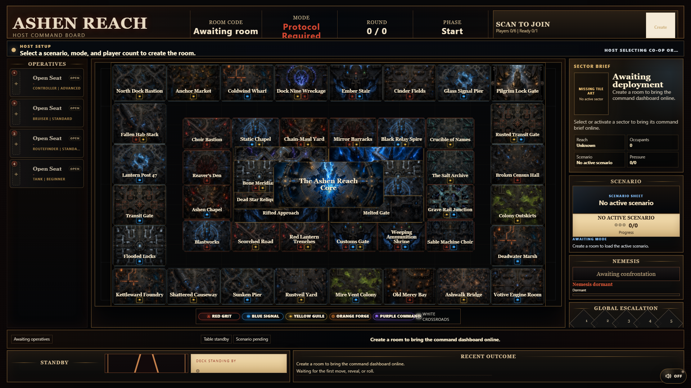
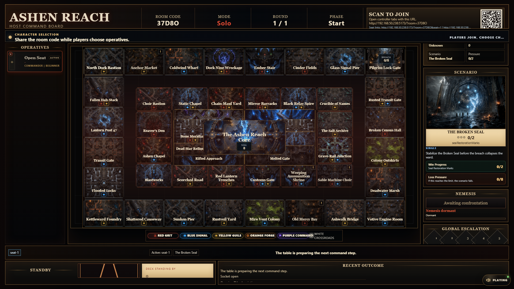
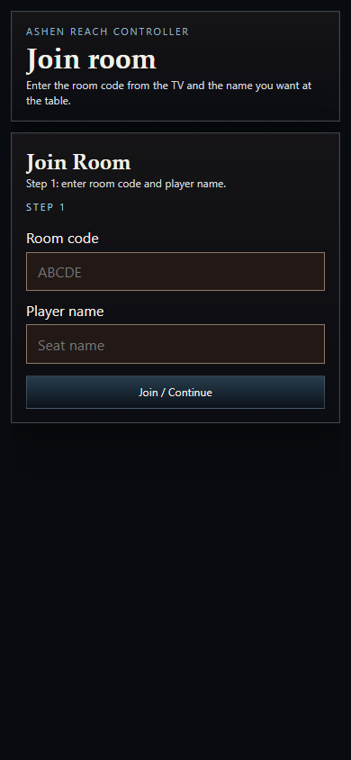
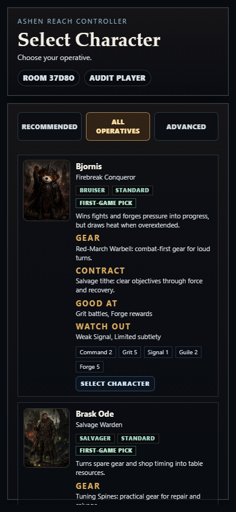
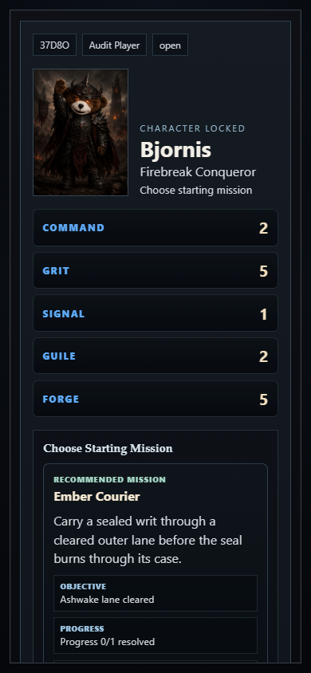
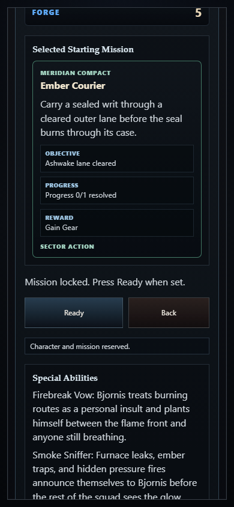
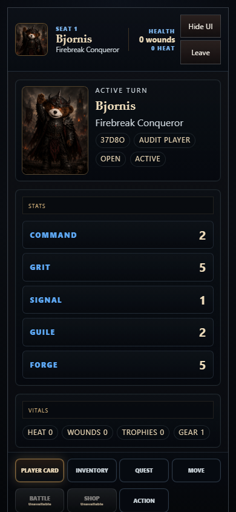
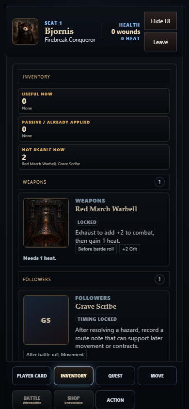
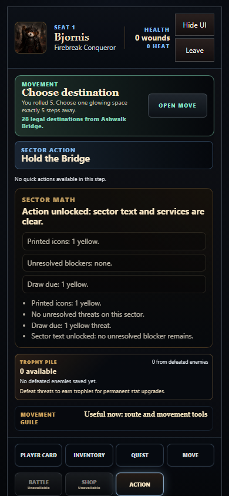
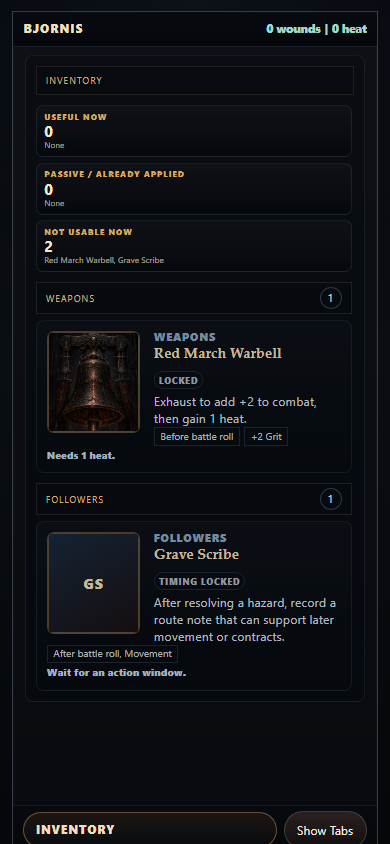

# Ashenreach Player Experience UI Audit

Captured: 2026-07-06T11:12:05
Room code used for capture: `37D8O`

## Audit Scope

Evidence-based review of the current TV setup and phone player-controller journey: create room, join, choose character, choose starting mission, ready, active controller, inventory, movement, shop availability, and immersive mode. Focus is player experience: clarity, confidence, next action, trust, and accessibility risks visible from screenshots.

## Captured Steps

1. `01-tv-create-room.png` - TV command board before room creation (healthy but visually dense)
   - Note: Strong world tone and clear Create actions, but first-time players may scan multiple panels before understanding the primary host task.
   - Screenshot: 

2. `02-tv-lobby-room-created.png` - TV lobby after creating a single-player room (mostly healthy)
   - Note: Room code and join affordance are visible; setup status is present, but readiness details compete with map/scenario panels.
   - Screenshot: 

3. `03-phone-join-empty.png` - Phone join screen without room prefill (healthy)
   - Note: The screen is focused on room code and player name, which is good for staged onboarding. The panel still feels heavy for a simple two-field task.
   - Screenshot: 

4. `04-phone-character-select.png` - Phone character selection (mixed)
   - Note: The single top header helps, and role information is useful. The cards are information-rich enough that players may still have to read a lot before making a confident first pick.
   - Screenshot: 

5. `05-phone-starting-mission.png` - Phone starting mission selection after character choice (healthy with hierarchy risk)
   - Note: Mission choice correctly appears before Ready. The player goal is clearer, but the ready state and mission list share a lot of framed space.
   - Screenshot: 

6. `06-phone-ready-summary.png` - Phone ready summary after mission selection (healthy)
   - Note: Character and mission are visible before Ready, which builds trust. The next action is clear.
   - Screenshot: 

7. `07-phone-active-player-card.png` - Active phone controller on Player Card (mostly healthy)
   - Note: The controller structure is understandable and the bottom tabs are clear. The main weakness is density: player status, card content, and chrome all compete for the first viewport.
   - Screenshot: 

8. `08-phone-inventory.png` - Phone Inventory tab (mixed)
   - Note: Inventory groups communicate timing states, but item cards are dense. Players need fast answers: what can I use now, why not, and what changes if I tap it.
   - Screenshot: 

9. `09-phone-action.png` - Phone Action tab (mixed)
   - Note: The Action tab keeps the command surface private and reachable. The main player risk is knowing whether Action is the required next step or just a secondary tab.
   - Screenshot: 

10. `10-phone-battle-or-empty.png` - Battle unavailable while Action remains selected (limited evidence)
   - Note: This run did not guarantee an active battle. The disabled Battle state still needs to explain why the tab is present and when it matters.
   - Screenshot: 

11. `11-phone-shop-or-locked.png` - Phone Shop tab or locked shop state (limited evidence)
   - Note: This run did not guarantee an open shop. The disabled tab state is still important: players need the lock reason to explain why a tab exists but cannot be used.
   - Screenshot: 

12. `12-phone-immersive-inventory.png` - Phone immersive hidden UI on Inventory (healthy)
   - Note: Hidden mode gives space back and keeps a compact status strip plus summon control. This is a strong direction for repeated play.
   - Screenshot: 

## Strengths

1. The phone flow is now staged around a clear sequence: join, character, mission, ready, then controller. This supports first-time comprehension better than exposing all systems at once.
2. The TV and phone division is conceptually strong: TV gives public table state, phone gives private action and inventory control.
3. The bottom phone tabs make the main action categories discoverable. Inventory, Move, Battle, Shop, and Action are understandable player verbs.
4. Starting mission selection gives players a purpose before the game starts. That makes the setup feel more like choosing intent, not just picking a character skin.
5. Immersive mode is a good repeated-play feature. The compact status strip keeps essential state while returning vertical space to card content.

## UX Risks

1. Information density is still the largest player risk. Many phone cards carry title, status, tags, stats, explanations, and actions in the same visual weight. New players may read everything because nothing confidently says 'this is the decision.'
2. Locked and disabled states need more explanatory priority. A disabled tab or locked option should answer: why locked, what will unlock it, and whether the player should ignore it for now.
3. Movement has good route logic, but route confidence could be stronger. The player needs to instantly see destination, exact distance, route path, risk, reward, and blocker status without parsing dense text.
4. Inventory timing is useful but cognitively demanding. 'Usable now,' 'Passive,' and 'Timing locked' should be visually distinct enough that players can skim instead of compare card-by-card.
5. TV lobby setup has a lot of atmosphere and system state competing with the host's immediate job. For a host, the key questions are: who has joined, who is missing character/mission/ready, and can I start?

## Accessibility Risks

1. Dense uppercase labels and small chip text may be hard to read on real phones, especially under browser chrome or at high zoom.
2. Some contrast combinations look close to the edge from screenshots, especially muted secondary text over dark textured panels. This needs automated contrast sampling or manual WCAG checks.
3. Disabled controls are visible but may not always communicate their reason to screen-reader users without interaction. Lock reasons should be programmatically associated with disabled buttons/tabs.
4. Screenshot evidence cannot confirm keyboard focus order, screen-reader announcements, or dynamic live-region behavior. Those need interactive accessibility testing.

## Recommendations

1. Make every active phone screen answer three questions at the top: what is happening, what can I do, and why is it legal or locked?
2. Use a stronger card hierarchy: title and primary status first, one-line consequence second, action button third, details expandable or lower priority.
3. Restore wrapped media card layouts for inventory, shop, and movement cards. Image top-left with text wrapping beside and below it will make cards feel more like readable game cards and less like dense admin rows.
4. Promote lock reasons into the disabled tab/card area. Example: 'Shop locked: clear Cinder-Veil Stalker first.'
5. For movement, add a compact route confidence block: '6 steps | exact route | shop reward | 1 blocker.' Let the long route list sit below that.
6. On TV lobby, visually separate host-critical setup readiness from atmospheric board/scenario panels. The host should not have to hunt for who is blocking start.
7. Keep immersive mode as a core player comfort feature and extend the same 'less chrome, more content' principle to long card lists.

## Evidence Limits

This audit used a single live single-player capture at 390x844 phone and 1920x1080 TV. It did not guarantee legal movement destinations, open shop stock, multiplayer wait states, rivalry privacy states, or battle resolution states. Accessibility findings are screenshot-informed risks, not full WCAG certification.

## Technical Capture Notes

- Console errors captured: 0
- Page errors captured: 0
- Each screenshot was saved as PNG and checked for valid PNG dimensions and non-trivial file size.
